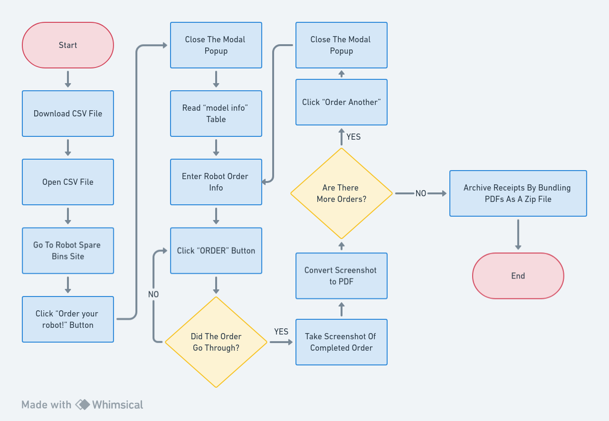
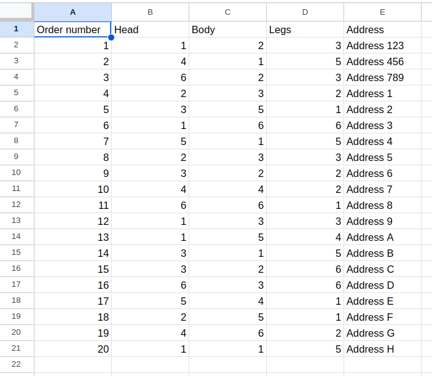

```{r setup, include=FALSE}
knitr::opts_chunk$set(echo = TRUE)

library(magrittr)
library(tibble)
```

# Versioning

You should set up your process definition document so that it is easy to update and to archive. If you are not using a versioning system, we recommend at last to add the version in the file name and adding a table inside the document to show the current and previous versions.

```{r, echo = F}
tibble::tribble(
~Date,       ~Version, ~Author,
"2023-10-10", 1.0, "John Doe"
) %>% knitr::kable()
```

# Signed Off By

```{r, echo = F}
tibble::tribble(
~Name,       ~Function, ~Responsibility,
"John Doe", "RPA Developer", "Develop and maintain automations"
) %>% knitr::kable()
```

# Contributors

```{r, echo = F}
tibble::tribble(
~Name,       ~Function, ~Responsibility,
"John Doe", "RPA Developer", "Develop and maintain automations",
"Jane Doe", "HR", "N/A",
) %>% knitr::kable()
```

# Current Process Analysis

## Description

To execute this process the user:

* Orders robots from RobotSpareBin Industries Inc.
* Saves the order HTML receipt as a PDF file.
* Saves the screenshot of the ordered robot.
* Embeds the screenshot of the robot to the PDF receipt.
* Creates a ZIP archive of the receipts and the images.

## Systems Involved

```{r, echo = F}
tibble::tribble(
~System, ~`Used For`, ~`User Role Needed`,
"Microsoft Excel", "Getting the data to order the robots", "The employee must download it from the site",
"Website (https://robotsparebinindustries.com/#/)", "Site to place the orders", "N/A",
) %>% knitr::kable()
```

## Process Flow

One of the best ways to show the steps of a process is via a flowchart, a widely used convention when describing procedures and algorithms. There is a variety of software to easily create flow charts: good options for example are Diagrams.net (free) or Lucidchart (free with paid option), or Microsoft Visio (paid).


## Steps

**1. User Downloads And Opens CSV File**

The user downloads the csv from this url:

https://robotsparebinindustries.com/orders.csv


**2. User Navigates To Robot Spare Bins Site And Clicks "Order your robot" Button**

**3. User Closes Modal Popup**

This can be closed by pressing any option besides "no way!".

**5. User Clicks "show model info" Button**

Clicking this button opens a table that allows the user to match the part number in the csv with the modal name.

**6. User Enters A Row's Info Into The Form**

**7. User Clicks "Order" Button**

If the order is submitted the user moves on. If the user gets an error they re-click the Order button until the order goes through.

**8. User Takes A Screenshot Of the Invoice**

**9. User Converts The Screenshot To PDF**

**10. User Repeats Order Process For All Rows In The CSV**

To submit another order the user clicks "Order Another" and closes the same modal in step 4.

**11. User Archives All Invoice PDFs To A Zip File**

# Possible Exceptions

## Logic Exceptions

There are none.

## System Exceptions

The order submission can fail at random but that is accounted for in the automation implementation.


