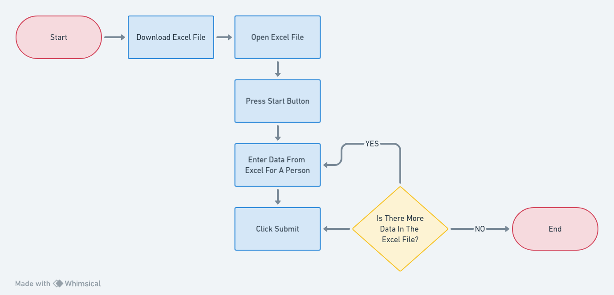
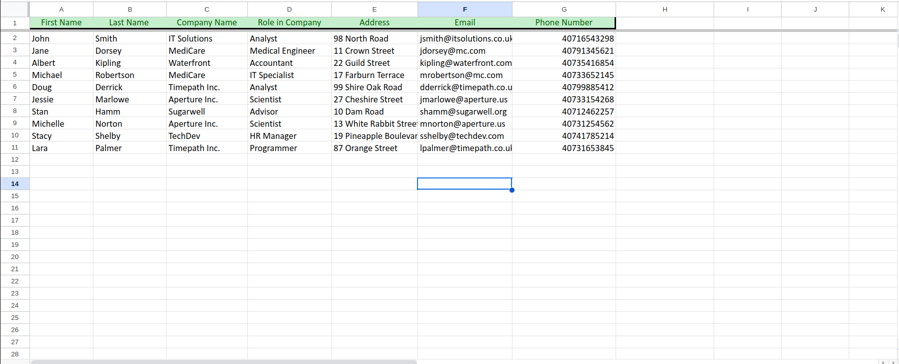
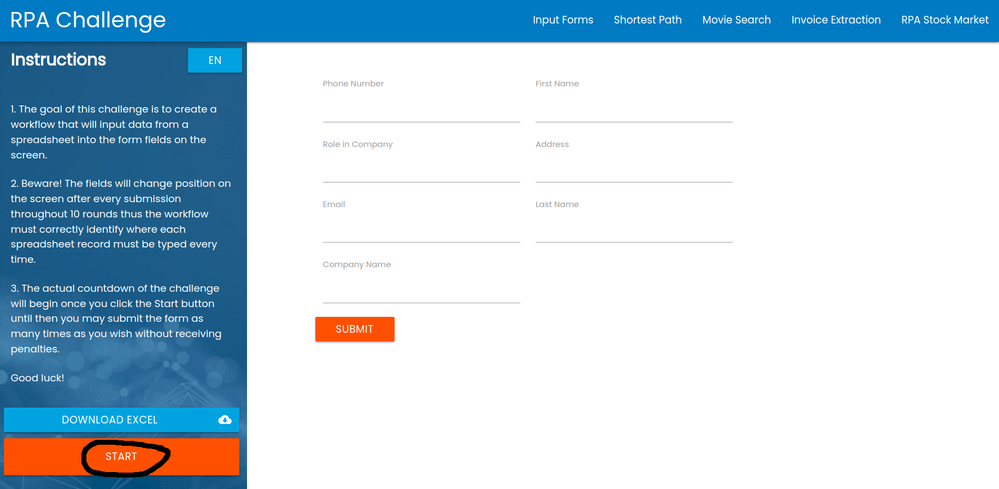
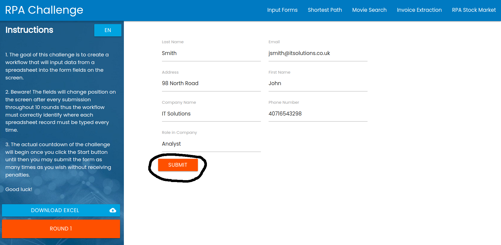

```{r setup, include=FALSE}
knitr::opts_chunk$set(echo = TRUE)

library(magrittr)
```

# Versioning

```{r, echo = F}
tibble::tribble(
~Date,       ~Version, ~Author,
"2023-10-10", 1.0, "John Doe"
) %>% knitr::kable()
```

# Signed Off By

```{r, echo = F}
tibble::tribble(
~Name,       ~Function, ~Responsibility,
"John Doe", "RPA Developer", "Develop and maintain automations"
) %>% knitr::kable()
```

# Contributors

```{r, echo = F}
tibble::tribble(
~Name,       ~Function, ~Responsibility,
"John Doe", "RPA Developer", "Develop and maintain automations",
"Jane Doe", "HR", "N/A",
) %>% knitr::kable()
```

# Current Process Analysis

## Description

The process enters data for Company Name, Address, Email, Phone Number, Role In Company, First Name, and Last Name for several people into an online form one by one. The source of this data is on the same site as the form.

In the process' manual state the user:

- Downloads an excel file from https://rpachallenge.com/
- Opens the excel file
- Presses the start button on the same site
- Enters the aforementioned information into the form for each person, clicking the Submit button after filling out each form.

## Systems Involved

```{r, echo = F}
tibble::tribble(
~System,       ~`Used For`, ~`User Role Needed`,
"Microsoft Excel", "Getting the data to enter into the form", "The employee must download it from the site",
"Website (https://rpachallenge.com/)", "Place to download the data, and location of the form to enter the data in", "N/A",
) %>% knitr::kable()
```

## Process Flow



## Detailed Steps

**User Downloads Excel File**

The file is located at from https://rpachallenge.com and can be downloaded by pressing the button circled in the photo below.


**User Opens The File**

Once downloaded the file looks like this:



**User Presses Start Button**

Back at https://rpachallenge.com the user presses the Start button indicated below to begin entering the information from the spreadsheet. 


**User Enters Data Into Form**

The user enters the data from the spreadsheet row by row into the form, pressing submit after each row's data has been entered.



Note that the input fields are not static and will move around after each press of the Submit button.

# Possible Exceptions

## Logic Exceptions

There are none.

## System Exceptions

There are none.